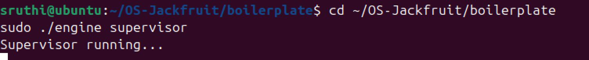
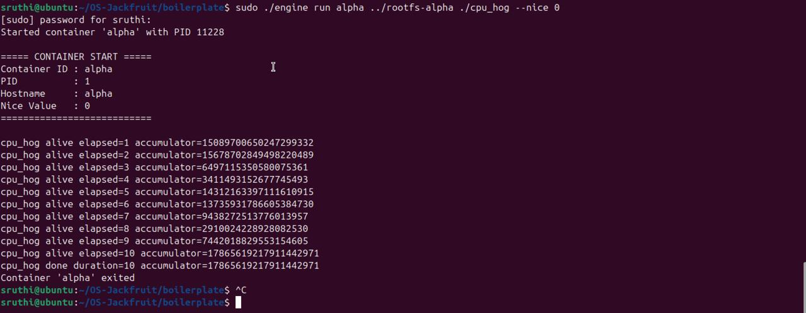
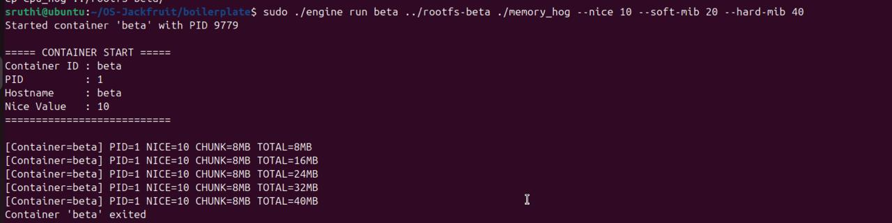
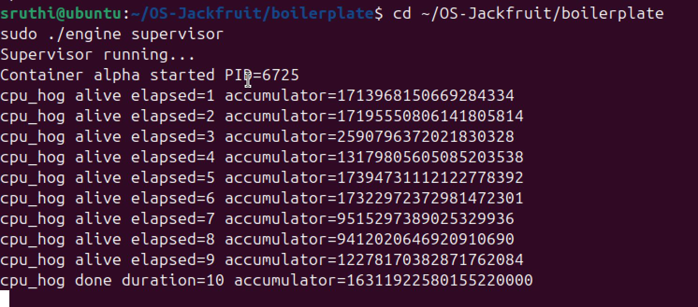
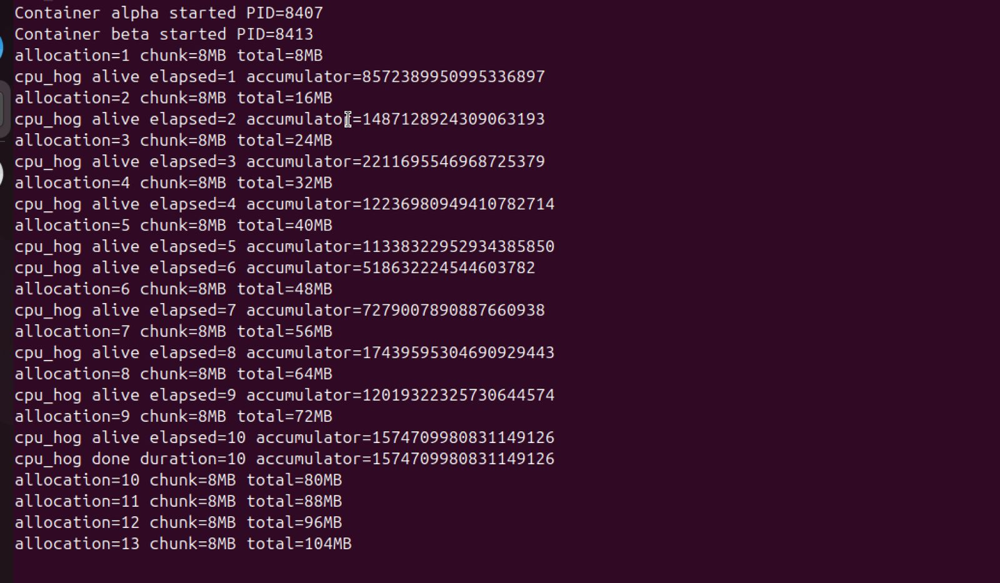
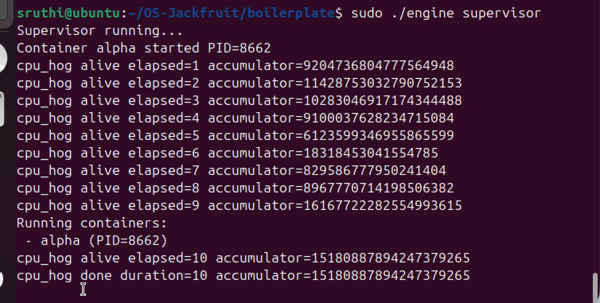
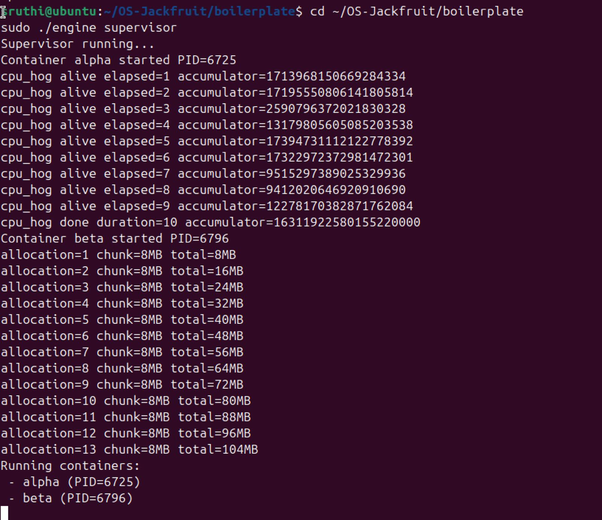
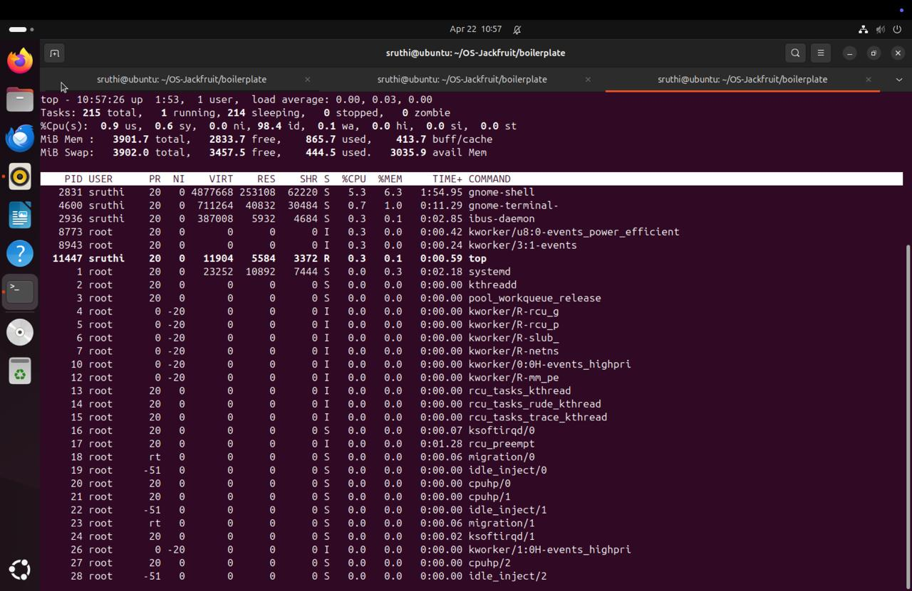
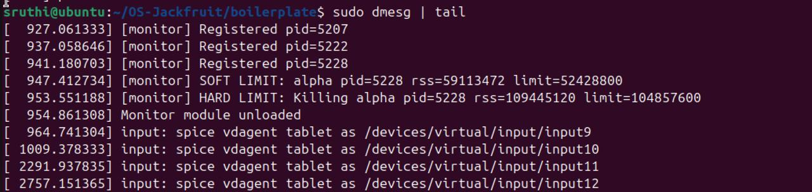

#  Mini Container Runtime (OS Jackfruit)

##  Overview

This project implements a lightweight container runtime in C using Linux namespaces and a kernel module for memory monitoring.

It demonstrates process isolation, IPC (sockets), and kernel-level resource control.

---

##  Features

* Multi-container execution
* Supervisor process
* CLI commands:

  * start
  * ps
  * stop
  * logs
* Namespace isolation (PID, UTS, Mount)
* `/proc` mounting
* Kernel memory monitoring
* Soft limit warning
* Hard limit enforcement (process kill)

---

##  Architecture

###  User Space

* `engine.c` → runtime + supervisor
* UNIX sockets → communication

###  Kernel Space

* `monitor.c` → memory monitoring
* `/dev/container_monitor` → interface

---

## 🚀 How to Run

### Build

```bash
cd boilerplate
make
```

### Load module

```bash
sudo insmod monitor.ko
```

### Start supervisor

```bash
sudo ./engine supervisor
```

### Run containers

```bash
sudo ./engine start alpha ../rootfs-alpha /cpu_hog
sudo ./engine start beta ../rootfs-alpha /memory_hog
```

### List containers

```bash
sudo ./engine ps
```

### View logs

```bash
sudo ./engine logs alpha
```

### Stop container

```bash
sudo ./engine stop alpha
```

### Check kernel logs

```bash
sudo dmesg | grep monitor
```

---

##  Screenshots




### Alpha Container Execution



### Beta Container Execution



### CPU Hog Execution



### Memory Hog Execution


### Multi Container Execution



### PS Command Output



### Logs Output



### CPU Utilization



### Hard and Soft Limit Triggered


---

##  Observations

* CPU workload runs continuously
* Memory workload increases gradually
* Soft limit generates warning
* Hard limit kills process automatically

---

##  Concepts Used

* `clone()` → container creation
* `chroot()` → filesystem isolation
* `ioctl()` → kernel communication
* UNIX sockets → IPC
* Kernel monitoring → resource enforcement

---

##  Conclusion

This project successfully demonstrates a mini container runtime similar to Docker with kernel-level memory enforcement.

---
